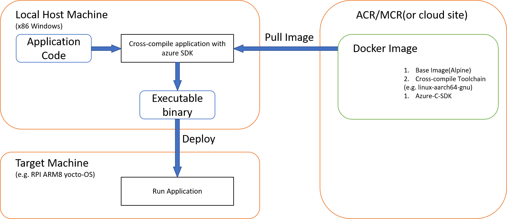

# Best Practice To Build A Toolchain Base Image

## Background

Below diagram is the E2E development model in our Device First DevExp. In the development model, we wrap the preparation logic in a docker image, so users don't need to handle the annoying cross-compilation stuff. According to their specific needs(eg. their host and target machine architecture, the additional driver libraries they need), users pull an docker image from ACR or cloud site, run the docker image so their application can be cross-compiled, generating executable file which can be executed on the target machine.

|  |
|:--:|
| *E2E Development Model* |

In the actual production situation, companies that embrass our development model are mainly traditional embeded vendors. These companies' production environment do not have a very fast Internet connection. In poor internet condition, pulling a 1GB docker image(600MB after compressed) may require hours, which is unbearrable. That is to say, **A docker image with small size matters**. Therefore, we apply some practice to reduce our Docker image's size, improving the user experience.

This article introduce our practice to reduce docker image's size. Here we go!

## Tips to Reduce Docker Image Size when Writing Dockerfile

1. Use a Smaller Base Image

    ```bash
    FROM frolvlad/alpine-glibc
    ```

    It is common practice to use the `ubuntu` as the base image. Look at the [popular base images' size comparison](https://www.brianchristner.io/docker-image-base-os-size-comparison/), `ubuntu` base image will take up 188MB.  
    We use the `alpine` base image instead. `Alpine Linux` is a security-oriented, lightweight Linux distribution based on **musl libc** and Busybox.  
    `Alpine` doesn't use glibc, but musl libc. Dynamic binaries are not fully portable. But in our case, we need the glibc to support cross-compilation. Here we leverage frolvlad's work. Our base image is [`alpine-glibc`](https://hub.docker.com/r/frolvlad/alpine-glibc/), an image based on Alpine Linux image, which is only a 5MB image, and contains glibc to enable proprietary projects compiled against glibc (e.g. OracleJDK, Anaconda) work on Alpine.

    |  |
    |:--:|
    | *popular base images' size comparison* |

2. Minimize Layers

    Each line of a Dockerfile is a step in the build process; a layer that takes up size. Combine your RUN statements to reduce the image size. Instead of

    ```bash
    RUN apt-get update
    RUN apt-get install -y <package-A>
    RUN apt-get install -y <package-B>
    ```

    DO

    ```bash
    RUN apt-get update && \
        apt-get install -y <package-A> <package-B>
    ```

3. Better Handle the Packages Installation Thing

    ```bash
    # If you are on ubuntu and thus using `apt-get` as the package manager
    RUN apt-get update && \
        apt-get install -y --no-install-recommends <package-A> <package-B> && \
        # Some steps with the packages, after which these packages are no longer needed.
        apt-get remove -y <package-A> <package-B> && \
        apt-get clean && \
        rm -rf /var/lib/apt/lists/* && \
        apt autoremove -y

    # If you are on alpine and thus using `apk` as the package manager
    RUN apk add --no-cache --virtual .build-deps <package-A> <package-B> && \
        # Some steps with the packages, after which these packages are no longer needed.
        apk del --no-cache .build-deps
    ```

    There are several noteworthy points.

    * Adding `--no-install-recommends` to `apt-get install -y` can help dramatically reduce the size by avoiding installing packages that aren’t technically dependencies but are recommended to be installed alongside packages.  
    * When the packages are no longer needed, remove the packages with `apt-get remove -y` and `clean`, as long as `rm -rf /var/lib/apt/lists/*` to remove package list cache maintained.
    * `apk add` commands should have `--no-cache` added.
    * Adding `--virtual` flag to `apk add` gives a name to this group of packages. Then you will be able to remove all of them, using `apk del --no-cache <package-group-name>`.

4. Dockerfile Optimization

    Use [this website](https://www.fromlatest.io/#/) to double check your Dockerfile.

## Investigation

After applying the best practice of writing the Dockerfile, we successfully reduce our docker image's actual disk usage by 390MB, now the alpine-azure-app docker image has a size of 1.114GB(*1GB=1000MB here). Is it enough? Does a docker image with a size of 1.114GB meet our customers' needs and how's the performance? To figure out the painpoint between size and internet transmission, we do the following investigation.

1. Get the compressed size of docker image

    * Enable docker experimental features  
        Edit `~/.docker/config.json` file and set `experimental` to `enable`. We enable docker's experimental features in order to use the `docker manifest` command.

        ```bash
        # ~/.docker/config.json
        "experimental": "enabled"
        ```

    * Gain compressed size of docker images which we host on ACR.

        ```bash
        docker manifest inspect -v devicedevex.azurecr.io/alpine-azure-sdk | grep size | awk -F ':' '{sum+=$NF} END {print sum}' | numfmt --to=iec-i
        ```

        For docker image on DockerHub, simply use the below command to get its compressed size. The below command is an example to calculate the compressed size of `alpine:latest`. Replace image name and tag to get the image size you want.

        ```bash
        curl -s -H "Authorization: JWT ${TOKEN}" "https://hub.docker.com/v2/repositories/library/alpine/tags/?page_size=100" | jq -r '.results[] | select(.name == "latest") | .images[0].size' | numfmt --to=iec-i
        ```

        The reason that we use different parse schema for different registry is that different registries store docker image's manifest file in a different way.

    * Compare our docker images' size

    | Image       | Compressed Size  | Decompressed Size |
    | :------------- |:-------------:|:-------------: |
    | devicedevex.azurecr.io/alpine-linux-arm64 | 222MB(213Mi) | 796MB(760Mi) |
    | devicedevex.azurecr.io/alpine-azure-sdk | 388MB(370Mi) | 1.06GB(1008MiB) |

2. Comparison

    From the former step, we know that our optimization is rather good. User needs to pull a docker image of compressed size 370Mi if he wants to use our tool to build his application. If the user's internet speed is 10MBps(transfer `10 * 1024 * 1024` Bytes per second), then he needs `370 * 1024 * 1024 / (10 * 1024 * 1024) = 37s` to donwload our base image.  
    In case our customer has poor internet speed, let's use a Plan B to lighten our base image, making it only handle preparing environment job, whcich can cut down base image's size and the image download time can be reduced. On the other hand, local build time will increase. We transfer the tool build time to local build runtime.

    Let's compare these two methods disk usage and total time consumption.

    | Scheme | Description | Base Image Compressed Size | Local Disk Usage | Thinkpad Carbon X1 Yoga | Workstation |
    | :-------------| :------------- |:-------------:|:-------------: |:-------------: |:-------------: |
    | **Original version** | base image: **Donwload** and **extract** cross-compile toolchain. Build Azure-sdk dependencies with the toolchain(openssl, curl, uuid) <br/>user image: Compile user appication with Azure SDK   | `alpine-linux-arm64`: 222MB(213Mi)<br/>`alpine-azure-sdk`: 388MB(370Mi) | `alpine-linux-arm64`: 796MB(760Mi) <br/>`alpine-azure-sdk`: 1.06GB(0.984GiB) <br/>`alpine-azure-app`: 1.11GB(1.03GiB) | **Total**: 14min<br/>**download base image**: 11min <br/>**build time**: 3min11s | **download base image**: 1min <br/>**build time**: 3min |
    | **Lighter version** | base image: **Donwload** cross-compile toolchain <br/>user image: **Extract** toolchain. Download and build  Azure-sdk dependencies. Compile user appication with Azure SDK | `lighter-linux-arm64`: 123MB(118Mi) <br/>`lighter-azure-sdk`: 281MB(268Mi) | `lighter-linux-arm64`: 129MB(123Mi) <br/>`lighter-azure-sdk`: 366MB(350Mi) <br/>`lighter-azure-app`: 1.26GB(1.17GiB) <br/>(Size **increased** by 150MB(149Mi)) | **Total**: 15min<br/>**download base image**: 8min <br/>**build dependencies**: 5min <br/>**build azure sdk and app**: 3min | **download base image**: 40s <br/>**build time**: 8min |
    | **Lighter version2** | base image: **Donwload** cross-compile toolchain and dependencies <br/>user image: **Extract** toolchain. Build  Azure-sdk dependencies. Compile user appication with Azure SDK | `lighter-azure-sdk2`: 281MB(268Mi) | `lighter-azure-sdk2`: 385MB(367Mi) | | **build time**: Around 8min|

    **Test Machine**:
    * Thinkpad Carbon X1 Yoga: 88.50 Mbit/s download speed
    * Workstation: 183.19 Mbit/s download speed

    **Toolkit**:

    ```bash
    # Install moreutils to use ts
    sudo apt-get install moreutils

    # Measure time elapse during docker build
    docker build -t <image-name> . --no-cache | ts > <image-name>.log 2>&1

    # Check every step time elapse
    cat <image-name>.log | grep Step
    ```

    **Conclusion**:

    1. Original version: It is better. Base image pull time is acceptable, local build time is the least.

    2. Lighter version: Base image is smaller and thus base image pull time can be reduced by 27%, around 3min. But it takes too long to build application every time, around 8min.

    3. Lighter version2: Download Azure SDK dependencies in advance. Time is roughly the same as lighter version.

    In a nut shell, original version is better since base image size(370Mi) is acceptable. Extracting toolchain and build dependencies every application build time gives bad performance(8 min every time).


## Reference

* [Tips to Reduce Docker Image Sizes](https://hackernoon.com/tips-to-reduce-docker-image-sizes-876095da3b34)
* [Reduce Docker image sizes using Alpine](https://www.sandtable.com/reduce-docker-image-sizes-using-alpine/)
* [Best practices for writing Dockerfiles](https://docs.docker.com/develop/develop-images/dockerfile_best-practices/)
* [docker manifest inspect](https://docs.docker.com/engine/reference/commandline/manifest_inspect/)