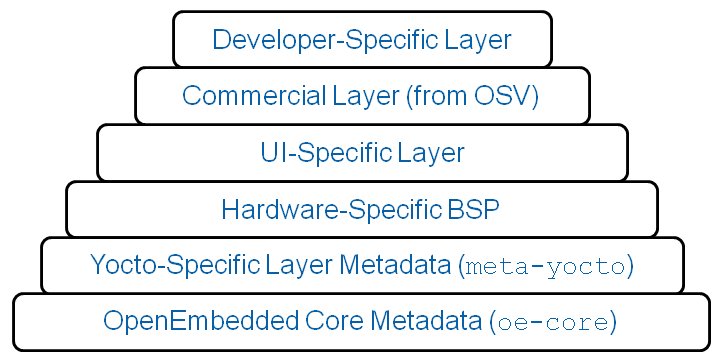

# Yocto Investigation

## Q & A

1. What is Yocto Linux?

    *Definition*:

    The Yocto Project (YP) is an open source collaboration project that helps developers create custom Linux-based systems regardless of the hardware architecture.

    The project provides a flexible set of tools and a space where embedded developers worldwide can share technologies, software stacks, configurations, and best practices that can be used to create tailored Linux images for embedded and IOT devices, or anywhere a customized Linux OS is needed.

2. Why do people choose Yocto Linux?

    Background:
    * Linux is popular for embedded, and has many distros(commercial / non-commercial).
    * Developers spends lots of time porting and making build systems, leaving less time / money to develop software features.

    Advantanges:
    * **Support various architectures(Intel x86(32 & 64 bit), ARM, MIPS, AMD, PPC, and others).**
    * **Strong community.** YP is widely adopted through the embedded/IoT industry(See [Community](https://www.yoctoproject.org/community/)). Most ODMs, OSVs and chip vendors provide SDKs, BSPs and other supportive structures for use with Yocto Project. See [Ecosystem](https://www.yoctoproject.org/ecosystem/), [Members](https://www.yoctoproject.org/ecosystem/members/), [Associates](https://www.yoctoproject.org/ecosystem/associates/), [Paticipants](https://www.yoctoproject.org/ecosystem/participants/).
    * **YP output is easy to transfer to another architecture**: simply a matter of couple of changes in the configuration file.
    * **It is designed for constrained embedded and IoT device needs.** Yocto Project is designed so that you only add what you want or packages as needed without having to remove and slim down a default distribution. Yocto Project provides an example embedded distribution (Poky) to get you started quickly. The Yocto Project provides this reference distribution in tiny, small medium and large footprints adding typical embedded device capabilities in exchange for an increase in footprint. This reference OS can be the starting point for you to develop your own customized Linux distribution. It provides sensible defaults to allow developers to get started quickly but the mechanisms to change these policies are well documented and simple to adopt.

    Disadvantages:
    * Have a steep learning curve. Providing the ultimate in customization capability means the mechanisms to do so are varied and diverse, and can be __hard to choose how to procceed__.
    * Getting start is easy and quick but understanding what changes need to be made for your particular design may require a non-trivial amount of research and investigation.
    * Different development workflow: Installing new packages is different. In a desktop development environment, the host OS provider generally provides a mechanism to install new packages(eg. Ubuntu: apt-get command). In Yocto, you will need to modify your configuration and rebuild to add additional packages; there are no Internet-hosted package libraries generally available to pull from.
    * The initial build times for a full Yocto Project build can be significant(4-8h(or even longer) concerning your host machine performance and the image configuration).

    See more in [IS YOCTO PROJECT® FOR YOU?](https://www.yoctoproject.org/is-yocto-project-for-you/), [Why the Yocto Project for my IoT Project?](https://www.embedded.com/electronics-blogs/say-what-/4458600/Why-the-Yocto-Project-for-my-IoT-Project-)and [official introduction ppt](https://elinux.org/images/9/93/Elce11_stewart.pdf).

3. Which devices are running Yocto Linux? What is the hardware requirement?

    Yocto Project works on any architecture. Either the silicon or ODM supplier has written a supportive BSP or if you have custom silicon, you can create a BSP following YP's specifications. Yocto Project supports Intel, ARM, MIPS, AMD, PPC, and others.

4. What kind of IoT scenario / area that Yocto servers for?

    If you’re developing embedded or IoT devices then chances are Yocto Project will be an effective solution for your product or development needs (unless your project is a simple one-off). Thousands of developers worldwide have discovered that Yocto Project provides systems development advantages, application development advantages, product archival and management benefits, and of course, the ultimate in customization capability to develop for speed, footprint and memory utilization.

5. What's the typic DevEx of Yocto Linux? Pain points?

    See the `Disadvantages` above.

## Yocto Overview

1. Content:

    * Complete Linux OS with package metadata
    * Releases every 6 months with latest (but stable) kernel, toolchain, and package versions.
    * Place for Industry to publish BSPs.
    * App Dev Tools which allow development against the stack, including Eclipse plug-ins and emulators. See [ADT](https://www.yoctoproject.org/docs/1.6.1/adt-manual/adt-manual.html).
    * Full documentation representative of a consistent system.

2. Sctructure overview

    |  |
    |:--:|
    | *YP overview* |
3. How does it work:
    |  |
    |:--:|
    | *yp how it works new diagram* |
    * Configuration(*.conf)
        * build/conf/local.conf (local user-defined variables)
            * Set *BB_NUMBER_THREADS* and *PARALLEL_MAKE*, based on the number of threads in the machine
            * Set *MACHINE="foo"* for the CPU architecture
            * *EXTRA_IMAGE_FEATURES* adds features (groups of packages)
            * *INCOMPATIBLE_LICENSE = "GPLv3"* eliminates packages using this license (for example)
        * distro/poky.conf (Yocto policy config variables)
        * machine/routerstationpro.conf (machine-specific variables)
    * Metadata and patches: Recipes for building packages

        eg. *meta/recipescore/coreutils/coreutils_6.9.bb* builds the core utilities (version 6.9) and installs them.  *meta-recipes-core/coreutils/coreutils-6.9/* includes patches, also could include extra files to install
    * Layers
        * Layers contain extensions and customizations to base system
        * Can include image customizations, additional recipes, modifying recipes, adding extra configuration
            * Really just another directory to look for recipes in
            * Added to the BBLAYERS variable in build/conf/bblayers.conf
        * BSPs are layers that add machine settings and recipes\
        * • Machine settings are specified in a layer's conf/machine/xxx.conf file(s)

        |  |
        |:--:|
        | *layers* |
    * Kernel Development

        Two major advantages in YP:
        * Branching tools: Per-BSP git branches contain machine-specific kernel sources. Tools collect up the relevant tree of branches
        * Kernel features: patches and configuration fragments managed as a functional block

        Results:
        * Can turn on a collection of features for a given BSP
        * Less code duplication
        * Easier to choose a config fragment and patches

        Kernel tools details:
        * Components:
            * Kernel class: meta/classes/kernel.bbclass
            * Linux-Yocto recipe: meta/recipes-kernel/linux/linux-yocto*bb
            * Linux-Yocto git repository: http://git.pokylinux.org/cgit/cgit.cgi/linux-yocto-2.6.37
        * [Kernel versions](https://wiki.yoctoproject.org/wiki/Linux_Yocto):

            Yocto Project 2.6
            * LTS(Long Term Support) Kernel Version: linux-yocto_4.9
            * LTSI(Long Term Support Latest) Kernel Version: linux-yocto_4.14_
            * Released Kernel Version: linux-yocto-dev_4.18
    * Source Fetching

        * Recipes call out location of all sources, whether on the internet or local (Look for *SRC_URI* in *.bb files)
        * Bitbake can get sources from git, svn, bzr, from tarballs.(Complete list includes: http, ftp, https, git, svn, perforce, mercurial, bzr, cvs, osc, repo, ssh, and svk and the unpacker can cope with tarballs, zip, rar, xz, gz, bz2, and so on)
        * Versions of packages can be fixed or updated automatically (Add *SRCREV_pn- PN = "${AUTOREV}"* to local.conf)
        * Yocto Project sources mirror available as a fallback, if the sources move on the internet
    * Patching
    * Configure / Compile
    * Packaging
    * Image Generation
    * ADT Generation

See more on [Yocto software overview](https://www.yoctoproject.org/software-overview/).

## Yocto 101

See the article [build Yocto system for Raspberry Pi under win10-x86](https://github.com/VSChina/yocto/blob/master/buildYoctoRpi101.md) for details.

## Further develop with Yocto

After flash the `rpi-test-image` image to rpi's SD card, we can successfully see the kernel boot and get a login prompt.

Use a network cable to connect raspberry pi with network. type `ifconfig` and you can see `eth0` with a valid ip address.

To enable package management, add `EXTRA_IMAGE_FEATURES += " package-management "` in the local.conf. if `PACKAGE_CLASSES = "package_rpm"` is set, you should then be able to use `rpm` as the package management.

### Yocto with Azure

1. Bitbake poky image in respect to the hardware
2. Set up package upstream, install Azure SDK
3. Create customized layers to combine azure sdk with our system
